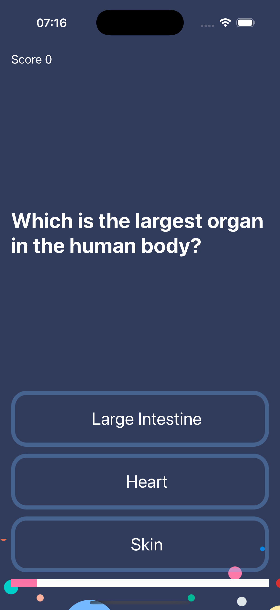
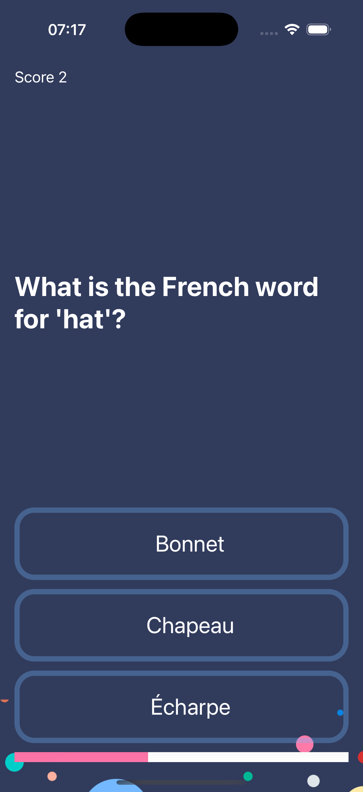
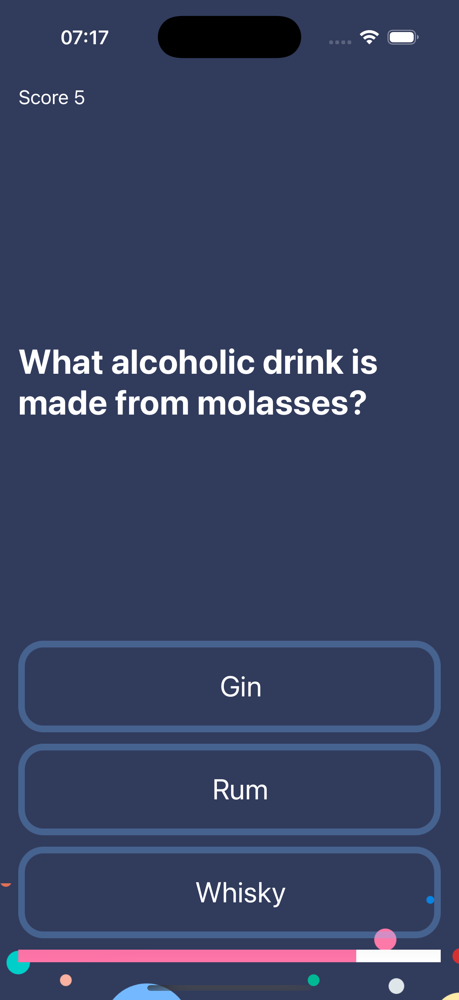

# ❓ Quizzy  

An interactive **iOS quiz app** built in Swift that tests the user’s general knowledge with multiple-choice questions.   

---

## ✨ Features  
- 🧠 **General Knowledge Quiz**  
- ✅ **Multiple-Choice Questions (MCQs)** 
- 📊 **Score Tracking**
- 🎨 **Simple UI** 

---

## 📱 Screenshots  

  
  
  

  

---

## 🛠️ Technologies Used  
- **Swift (UIKit)**  
- **MVC Design Pattern**   
- **Score Logic in Swift**  
